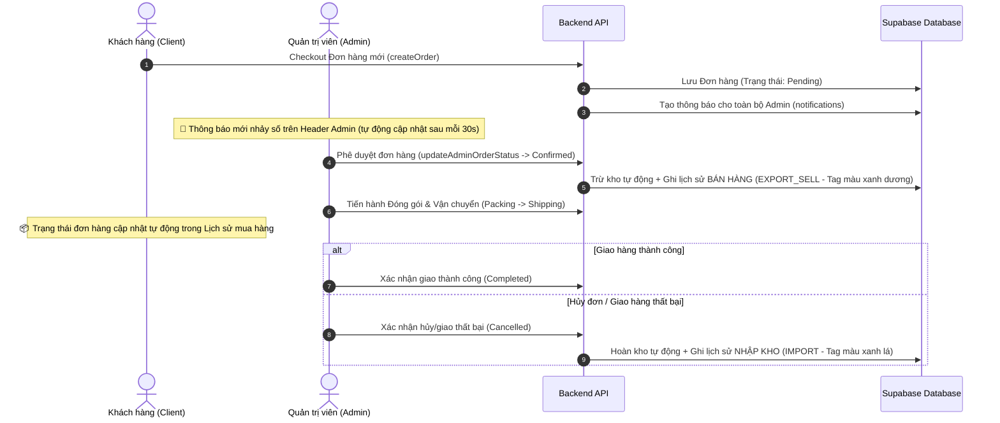

# 📋 TÀI LIỆU KẾ HOẠCH TÍCH HỢP FRONTEND (FRONTEND INTEGRATION PLAN)
> **Mục tiêu**: Hướng dẫn chi tiết cho lập trình viên Frontend tích hợp các luồng dữ liệu đơn hàng (Client $\leftrightarrow$ Admin), quản lý trạng thái, thông báo thời gian thực và nâng cấp bộ lọc lịch sử giao dịch kho cao cấp.

---

## 1. TỔNG QUAN HỆ THỐNG & LUỒNG NGHIỆP VỤ (WORKFLOW)

Hệ thống đã triển khai đầy đủ các logic nghiệp vụ phức tạp dưới Backend (Database Constraints, RLS, Inventory Logging). Công việc của Frontend là gọi đúng API và cập nhật giao diện trực quan cho người dùng theo quy trình sau:



---

## 2. CHI TIẾT CÁC NHIỆM VỤ TÍCH HỢP (TASKS)

### 📌 NHIỆM VỤ 1: Đặt hàng & Truyền thông báo (Client-side)
* **Màn hình**: Giỏ hàng (Cart) / Thanh toán (Checkout).
* **API cần gọi**: `createOrder(data)` trong `frontend/src/services/Order/apiClient.ts`.
* **Luồng xử lý**:
  1. Khi người dùng nhấn nút **Đặt hàng**, kiểm tra nếu giỏ hàng trống hoặc thông tin nhận hàng thiếu thì báo lỗi.
  2. Gửi request chứa: `cartItemIds`, `shippingAddress`, `paymentMethod`, `voucherId` (nếu có).
  3. Nếu thanh toán Online thành công $\rightarrow$ chuyển hướng qua trang kết quả và thông báo đặt hàng thành công.
  4. *Lưu ý*: Backend sẽ tự động phát sinh dòng thông báo (Notification) cho Admin, lập trình viên phía Client không cần tự ghi đè thông báo này.

---

### 📌 NHIỆM VỤ 2: Quản lý & Duyệt đơn hàng chuyên nghiệp (Admin-side)
* **Màn hình**: Quản lý Đơn hàng (`frontend/src/pages/Admin/Orders.tsx`).
* **API cần gọi**: `getAdminOrders()`, `getAdminOrderById(orderId)`, `updateAdminOrderStatus(orderId, status)` trong `frontend/src/services/adminOrderService.ts`.
* **Yêu cầu giao diện**:
  * **Status Steps**: Sử dụng cấu trúc `Steps` của Ant Design để mô tả tiến trình đơn hàng trực quan:
    `Chờ duyệt (Pending)` $\rightarrow$ `Đã xác nhận (Confirmed)` $\rightarrow$ `Đóng gói (Packing)` $\rightarrow$ `Giao hàng (Shipping)` $\rightarrow$ `Thành công (Completed) / Thất bại (Cancelled)`.
  * **Nút bấm chuyển trạng thái**: Hiển thị các nút điều hướng nghiệp vụ động dựa trên trạng thái hiện tại của đơn hàng:
    * Trạng thái **PENDING**: Hiển thị nút `Duyệt đơn hàng` (chuyển sang `Confirmed`) và `Hủy đơn` (chuyển sang `Cancelled`).
    * Trạng thái **CONFIRMED**: Hiển thị nút `Bắt đầu soạn hàng` (chuyển sang `Packing`) và `Hủy đơn` (chuyển sang `Cancelled`).
    * Trạng thái **PACKING**: Hiển thị nút `Bắt đầu vận chuyển` (chuyển sang `Shipping`) và `Hủy đơn` (chuyển sang `Cancelled`).
    * Trạng thái **SHIPPING**: Hiển thị nút `Giao hàng thành công` (chuyển sang `Completed`) và `Giao hàng thất bại` (chuyển sang `Cancelled`).

---

### 📌 NHIỆM VỤ 3: Tích hợp Hộp thông báo Động ở Header Admin
* **Màn hình**: Hộp thông báo (`frontend/src/components/NotificationPanel.tsx`).
* **API cần gọi**: `getNotificationsApi(userId)`, `readNotificationApi(id, userId)` trong `frontend/src/services/Notification/apiClient.ts`.
* **Yêu cầu giao diện**:
  * **Lấy dữ liệu thời gian thực**: Sử dụng `useEffect` gọi API khi Component Mount. Thiết lập hàm `setInterval` tự động làm mới (polling) mỗi **30 giây** để Admin nhận đơn hàng mới lập tức mà không cần F5.
  * **Hiển thị số lượng thông báo mới**: Đếm các bản ghi có `is_read = false` để hiển thị chấm tròn đỏ và số đếm **MỚI** trên icon chuông.
  * **Xử lý sự kiện bấm**: Khi Admin nhấp chuột vào một thông báo chưa đọc, lập tức gọi API `readNotificationApi` để cập nhật trạng thái đã đọc xuống Database, đồng thời cập nhật UI để chuyển chữ in đậm sang in thường (trạng thái đã đọc).
  * **Tính toán mốc thời gian tương đối**: Viết hàm tiện ích hiển thị thời gian thân thiện (Ví dụ: `Vừa xong`, `5 phút trước`, `2 giờ trước`, `3 ngày trước`).

---

### 📌 NHIỆM VỤ 4: Nâng cấp Bộ lọc Lịch sử Giao dịch Kho cao cấp
* **Màn hình**: Quản lý Kho (`frontend/src/pages/Admin/Inventory.tsx` $\rightarrow$ tab **Lịch sử giao dịch**).
* **Mục tiêu**: Thêm thanh công cụ bộ lọc phía trên bảng lịch sử để cho phép người dùng lọc chéo theo **Thời gian**, **Loại giao dịch** và **Từ khóa**.

#### 🛠️ Giao diện bộ lọc đề xuất (UI Layout):
```
+---------------------------------------------------------------------------------------------------+
|  [ Tìm kiếm SKU/Tên... 🔍 ]   [ Chọn loại: Tất cả / Nhập / Xuất hủy / Bán hàng 🔽 ]   [ Từ ngày - Đến ngày 📅 ]  |
+---------------------------------------------------------------------------------------------------+
```

#### 💻 Mã nguồn hướng dẫn triển khai bộ lọc bằng `useMemo` (Client-side):
Lập trình viên Frontend có thể chèn trực tiếp bộ lọc tối ưu hóa hiệu năng sau vào file `Inventory.tsx`:

```typescript
// 1. Khai báo thêm State quản lý bộ lọc
const [loaiGiaoDichFilter, setLoaiGiaoDichFilter] = useState<string>('ALL');
const [khoangThoiGian, setKhoangThoiGian] = useState<[dayjs.Dayjs | null, dayjs.Dayjs | null] | null>(null);
const [tuKhoaTimKiemLichSu, setTuKhoaTimKiemLichSu] = useState<string>('');

// 2. Logic lọc tổ hợp cực nhanh sử dụng useMemo
const danhSachLichSuLocDuoc = useMemo(() => {
  return danhSachLichSu.filter(log => {
    // A. Lọc theo từ khóa (SKU hoặc Tên sản phẩm)
    const matchKeyword = !tuKhoaTimKiemLichSu ? true : (
      log.sku?.toLowerCase().includes(tuKhoaTimKiemLichSu.toLowerCase()) ||
      log.productName?.toLowerCase().includes(tuKhoaTimKiemLichSu.toLowerCase())
    );

    // B. Lọc theo Loại phiếu (IMPORT / EXPORT_SELL / EXPORT_DELETE)
    const matchType = loaiGiaoDichFilter === 'ALL' ? true : log.type === loaiGiaoDichFilter;

    // C. Lọc theo Khoảng thời gian (Date Range)
    let matchDate = true;
    if (khoangThoiGian && khoangThoiGian[0] && khoangThoiGian[1]) {
      const startOfDay = khoangThoiGian[0].startOf('day').toDate();
      const endOfDay = khoangThoiGian[1].endOf('day').toDate();
      const logDate = new Date(log.timestamp);
      matchDate = logDate >= startOfDay && logDate <= endOfDay;
    }

    return matchKeyword && matchType && matchDate;
  });
}, [danhSachLichSu, tuKhoaTimKiemLichSu, loaiGiaoDichFilter, khoangThoiGian]);

// 3. Gắn danhSachLichSuLocDuoc vào thuộc tính dataSource của <Table> Lịch sử
// <Table dataSource={danhSachLichSuLocDuoc} ... />
```

---

## 3. THÔNG TIN PHỤ LỤC & ĐỊNH NGHĨA LOẠI GIAO DỊCH KHO

Nhắc nhở lập trình viên Frontend lưu ý các mã định danh loại giao dịch để hiển thị Tag màu sắc hài hòa và đúng tiêu chuẩn:

| Loại giao dịch (Backend trả về) | Nội dung hiển thị giao diện | Màu sắc Tag (Ant Design) | Ý nghĩa nghiệp vụ |
| :--- | :--- | :--- | :--- |
| **`IMPORT`** | **NHẬP KHO** | `green` (Xanh lá) | Phát sinh khi Admin nhập thêm hàng thủ công hoặc khi Đơn hàng bị Hủy/Giao lỗi (Hoàn kho). |
| **`EXPORT_DELETE`** | **XUẤT HỦY** | `red` (Đỏ) | Phát sinh khi Admin lập phiếu xuất bỏ hàng hư, lỗi, hỏng. |
| **`EXPORT_SELL`** | **BÁN HÀNG** | `blue` (Xanh dương) | Phát sinh tự động khi Đơn hàng chuyển sang trạng thái **Đã xác nhận** (Duyệt đơn trừ kho). |

---
> [!NOTE]
> Tài liệu này được biên soạn đầy đủ để lập trình viên Frontend hiểu ngay kiến trúc hệ thống và tích hợp giao diện nhanh nhất. Mọi API liên quan đã sẵn sàng ở Backend và được cấu hình định dạng dữ liệu chuẩn nhất. Nếu có bất kỳ câu hỏi nào trong quá trình tích hợp, lập trình viên có thể liên hệ trực tiếp để được giải đáp.
